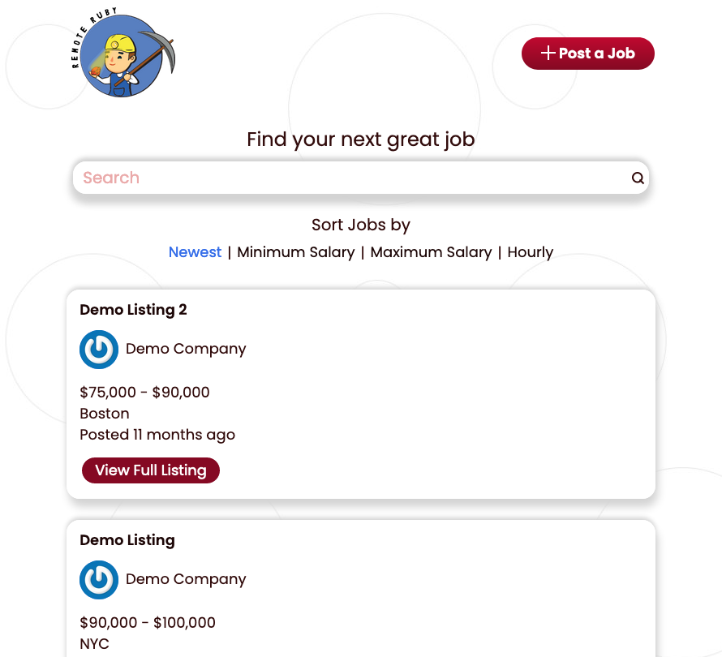

# Remote Ruby On Rails

A [job board](remoterubyonrails.com) focused on remote-first Ruby on Rails positions. Includes a small [blog](blog.remoterubyonrails.com) discussing the site's architecture.  



## Getting started

### Requirements

Ruby 3.1.2
PostgresQL 14.5

To support OmniAuth Google authentication, Devise expects a couple Rails secrets to be set up. They're referenced in config/initializers/devise.rb. To make this work, you'll need to set up Rails secrets by running:

```bash
rails credentials:edit
```

Create a section named "oauth", with secret names GOOGLE_CLIENT_ID and GOOGLE_CLIENT_SECRET (and plug in your own values for these). For AWS storage to work, you'll want to name a section "aws" and include secret names access_key_id and secret_access_key, plugging in your own values again. Note: you may need to set the EDITOR environment variable in order to edit secrets, by running for example:

```bash
export EDITOR=vim
```

As always, make sure you don't commit your config/master.key to version control!

Next, make sure you add a config/database.yml file set to use the username, password, and database name environment variables that you initialized the Postgres database with. These can be set in .env files as well. The reason this file isn't included in the repository in the first place is that the production site is deployed via Semaphore and Heroku, which use their own version.

Finally, make sure to run the "yarn" command to generate a manifest.json file.

### Development

Start the PostgreSQL server:

```bash
brew services start postgresql
```

Run the following to start the Rails server and build assets:

```bash
rails s
bin/webpack-dev-server
```

### Seeds

Seeding the database via lib/tasks/seed_db.rake creates 5 employers and 20 job listings.

### Testing

- Run `rails test` to run unit/integration tests.
- Run `rails test:system` to run system tests.
